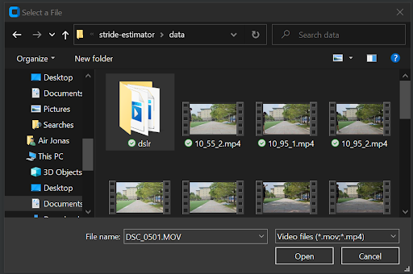
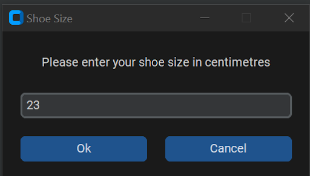
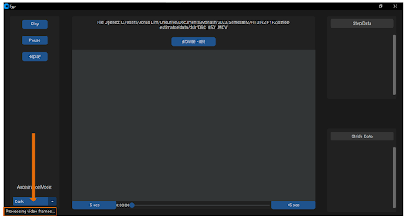
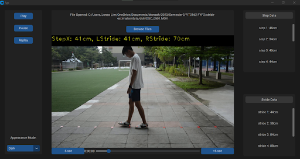

# Stride Estimator

## Project Overview
This repository contains the code and documentation for a Stride Estimator, a component of our final year project titled "Computer Vision-based Analysis on Human Movement." The Stride Estimator is designed to calculate stride length using pose estimation techniques.

## Team Members
- Sean Min Chang Goh
- Ethan Too
- Lim Jing Ee

## Project Supervisor
- Dr Raveendran Paramesran

## Table of Contents
- [Installation](#installation)
- [Usage](#usage)
- [How to Use the Program](#how-to-use-the-program)

## Installation

### Step 1: Navigate to the Desired Directory
Access the Terminal and navigate to the directory where you intend to locate the repository. Use the following command in Bash, replacing `[path]` with the actual directory path:
```bash
cd [path]
```

### Step 2: Clone the Repository
Clone the repository using the following command:
```bash
git clone https://github.com/Yoruuu/stride-estimator.git
```

### Step 3: Install the Required Packages
Install the required packages using the following command:
```bash
pip install -r requirements.txt
```

## Usage

To use the Stride Estimator application, follow these steps:

1. **Windows**:
   - Double-click on `stride_estimator.exe`.

2. **MacOS & Linux**:
   - Open a terminal.
   - Navigate to the directory where the Stride Estimator is located.
   - Run the following command:
     ```bash
     python stride_estimator_ui.py
     ```

3. After executing the appropriate command for your operating system, the Stride Estimator's graphical user interface (GUI) should appear on your screen.

## How to Use the Program

Follow these steps to use the program for step and stride analysis:

1. Click the "Browse Files" button.

   - This action will open the user's file dialog, allowing you to select a video input file for analysis (step and stride predictions).



   *Note*: The application currently accepts .mp4 and .mov video formats.

2. Choose a Video and Click "Open".
   - After selecting the desired video input file, click "Open" to submit the file to the model for analysis.

3. Insert Shoe Size and Click "OK".
   - Enter the shoe size in centimeters (cm) and click "OK." This data will be sent to the model for further processing.



   *Note*: The application currently accepts shoe sizes in centimeters.

4. Wait for the Model to Process and Calculate Output.
   - The model will take some time for execution, which includes reading the video input, processing, mapping, calculating, and producing the video output. Keep an eye on the bottom left text, "Processing video frames..." to know when the model is still executing.



5. Output Video Starts Playing.
   - Once the processing is complete, the output video will start playing. You will have control options to pause, play, replay, and skip the output video forward and backward by 5 seconds.



6. Review Step and Stride Data.
   - Columns on the right will display the step and stride data corresponding to the video. You can analyze this data as needed.

7. To Analyze Another Video, Repeat Steps 1-4.
   - If you want to analyze another video, simply repeat the process from steps 1 to 4.
